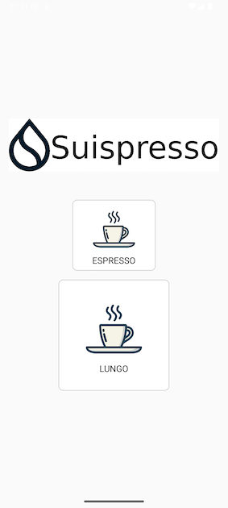

# Sui Coffee Machine App

This Android application allows users to interact with a smart coffee machine, making coffee selections and handling payments using the Sui blockchain.  
It communicates with the coffee machine via Bluetooth and interacts with the Sui testnet to verify payments.
The coffee machine is expected to provide a bluetooth interface API to 2 commands:
- Espresso
- Lungo.

In our PoC we integrated a Nespresso Coffee Machine with an Arduino Device.

## App Functionality

1.  **Coffee Selection:** The app presents options to make an Espresso or a Lungo.
2.  **Payment Handling:** When a user selects a coffee type, the app navigates to a payment screen.  A QR code representing the admin's Sui address is displayed, and the app monitors the admin's wallet balance for a payment of a specific amount.
3.  **Sui Blockchain Interaction:** The app uses the Sui blockchain's testnet to check the admin's wallet balance. It sends requests to a Sui fullnode to retrieve balance information.
4.  **Bluetooth Communication:** Once payment is confirmed, the app sends a command via Bluetooth to the coffee machine to start brewing the selected coffee.
5.  **Timeout:** The payment screen has a timer. If payment isn't detected within a certain time, the app closes the payment screen.

## Package Structure and Class Descriptions (`com.mystenlabs.suicoffeemachineapp`)

*   **`MainActivity.kt`:**
    *   **Purpose:** The entry point of the application. Displays the main screen with buttons for selecting coffee types (Espresso and Lungo).
    *   **Key Functionality:**
        *   Presents the user with coffee options.
        *   Handles button clicks to navigate to the `PaymentActivity` for the selected coffee.
        *   Passes the selected `CoffeeType` (Espresso or Lungo) to the `PaymentActivity` via an intent extra.

*   **`PaymentActivity.kt`:**
    *   **Purpose:** Handles the payment process and interacts with the Sui blockchain and the coffee machine via Bluetooth.
    *   **Key Functionality:**
        *   Displays a QR code for the admin's Sui address, representing the payment destination.
        *   Retrieves the selected `CoffeeType` from the intent extra.
        *   Uses the OkHttp library to make asynchronous API calls to a Sui fullnode, checking the admin's wallet balance.
        *   Manages a `CountDownTimer` to limit the payment waiting time.
        *   Upon successful payment detection:
            *   Displays a success message.
            *   Sends the appropriate command (Espresso or Lungo) to the coffee machine via the `BluetoothFacade`.
            *   Closes the activity.
        *   If the timer expires before payment is detected, it closes the activity.
        *   Handles errors related to API calls, JSON parsing, and invalid coffee types.

*   **`BluetoothFacade.kt`:**
    *   **Purpose:** Provides an abstraction layer for Bluetooth communication with the coffee machine.  It encapsulates the details of sending commands.
    *   **Key Functionality:**
        *   Offers methods like `sendEspressoCommandToMachine()` and `sendLungoCommandToMachine()`.  These methods would contain the actual logic for establishing a Bluetooth connection (if not already established) and sending the appropriate command codes to the coffee machine.
        *   The current implementation contains placeholder logic (logging a message) since the specific Bluetooth communication protocol for the coffee machine is not defined in the provided code.

*   **`CoffeeType.kt`:**
    *   **Purpose:** Defines an enum class representing the available coffee types.
    *   **Key Functionality:**
        *   The `CoffeeType` enum has two possible values: `ESPRESSO` and `LUNGO`.  This provides a type-safe way to represent the coffee selection within the app.

## Setup and Configuration

1.  **Android Project:**  This code should be placed within an Android Studio project.
2.  **Dependencies:** The project requires the following dependencies (specified in your `build.gradle` file):
    *   OkHttp: For making HTTP requests to the Sui fullnode.
    *   ZXing Android Embedded: For generating the QR code.
    *   Kotlin standard library and AndroidX core libraries.
    * **Bluetooth permissions**: Add bluetooth permissions in the manifest.
3.  **Permissions:** The app needs the `BLUETOOTH` and `BLUETOOTH_CONNECT` permissions in the `AndroidManifest.xml` file to communicate with the coffee machine.
4.  **Sui Fullnode URL and Admin Address:**  The `PaymentActivity` contains constants for:
    *   `SUI_FULLNODE_URL`: The URL of the Sui fullnode to interact with (currently set to the testnet).
    *   `ADMIN_ADDRESS`: The Sui address that will receive payments. **This should be replaced with your actual testnet address.**
5.  **Payment Amount:** The `PAYMENT_AMOUNT` constant defines the amount (in MIST) the app expects to receive for a coffee.
6.  **Bluetooth Implementation:**  The `BluetoothFacade` needs to be completed with the specific Bluetooth communication logic for your coffee machine, including device discovery, connection management, and command sending/receiving.
7.  **Error Handling**: Error handling has been implemented but should be thoroughly tested and expanded upon based on the specific needs and potential failure points of the application and the external systems it interacts with.

## Running the App

1.  Build and run the application on an Android device or emulator.
2.  Select a coffee type.
3.  The payment screen will appear, showing the QR code.
4.  Send the required amount of Sui to the displayed address from a Sui wallet.
5.  The app will detect the payment (within the timeout period), send the command to the coffee machine, and display a success message.

## Further Development

*   **Complete Bluetooth:** Implement the full Bluetooth communication within `BluetoothFacade` to interact with the coffee machine.
*   **User Interface:** Enhance the user interface with better visuals and user feedback.
*   **Error Handling:**  Improve error handling and user feedback for various failure scenarios (network issues, invalid payments, Bluetooth problems, etc.).
*   **Settings:** Add settings for configuring parameters like the Sui fullnode URL, admin address, payment amount, and Bluetooth device address.
